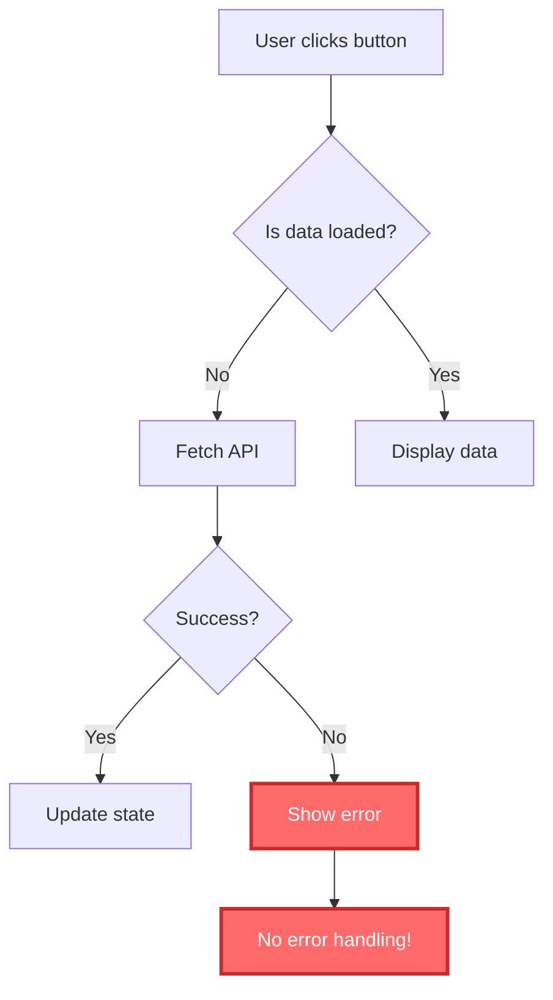

# Multi-Language Support Plan
## Extending the Code Analysis Extension for JavaScript, React, and More

---

## 🎯 Current State Analysis

### What Works (Python-Only):
- ✅ Compile-time error detection (AST-based)
- ✅ Runtime error prediction (CodeBERT model)
- ✅ Control flow visualization (Mermaid diagrams)
- ✅ LLM-based logic analysis
- ✅ Optimization suggestions
- ✅ Interactive chat interface

### What's Python-Specific:
1. **Backend analyzers** - All use Python's `ast` module
2. **CodeBERT model** - Trained on Python code patterns
3. **VS Code extension** - Only activates for `.py` files
4. **Control flow analyzer** - Uses Python AST nodes

---

## 🚀 Proposed Architecture for Multi-Language Support

### Option A: Language-Agnostic Approach (Recommended)
**Focus on visual flow understanding rather than language-specific analysis**

#### Advantages:
- ✅ Works for ANY language (Python, JavaScript, Java, C++, etc.)
- ✅ Simpler to implement
- ✅ Better for educational purposes
- ✅ LLM can handle multiple languages naturally

#### What Changes:
1. **Remove language-specific AST parsing**
2. **Use LLM for ALL analysis** (it understands multiple languages)
3. **Generic pattern matching** for control flow
4. **Language detection** based on file extension

---

### Option B: Multi-Language AST Approach
**Add parsers for each language**

#### Advantages:
- ✅ More accurate syntax checking
- ✅ Better control flow analysis
- ✅ Language-specific optimizations

#### Disadvantages:
- ❌ Need separate parser for each language
- ❌ More complex to maintain
- ❌ Slower to add new languages

---

## 📋 Recommended Changes (Option A - LLM-First)

### Phase 1: Make Extension Language-Agnostic ⭐ PRIORITY

#### 1.1 Update VS Code Extension
**File**: `vscode-extension/package.json`

**Current**:
```json
"activationEvents": ["onLanguage:python"]
```

**Change to**:
```json
"activationEvents": [
  "onLanguage:python",
  "onLanguage:javascript",
  "onLanguage:typescript",
  "onLanguage:javascriptreact",
  "onLanguage:typescriptreact",
  "onLanguage:java",
  "onLanguage:cpp",
  "onLanguage:c"
]
```

#### 1.2 Update Extension Logic
**File**: `vscode-extension/src/extension.ts`

**Remove Python-only check** (lines 86-91):
```typescript
// REMOVE THIS:
if (document.languageId !== 'python') {
    vscode.window.showWarningMessage('Please open a Python file to analyze');
    return;
}

// REPLACE WITH:
const supportedLanguages = ['python', 'javascript', 'typescript', 'javascriptreact', 'typescriptreact', 'java', 'cpp', 'c'];
if (!supportedLanguages.includes(document.languageId)) {
    vscode.window.showWarningMessage(`Language ${document.languageId} is not yet supported`);
    return;
}
```

**Add language detection**:
```typescript
const language = document.languageId;
// Send language to backend
const response = await axios.post(REVIEW_ENDPOINT, {
    code,
    language: language,  // NEW
    include_logic_analysis: true,
    include_optimizations: true,
    include_control_flow: true
});
```

---

### Phase 2: Update Backend for Multi-Language

#### 2.1 Add Language Parameter
**File**: `backend/main.py`

```python
class ReviewRequest(BaseModel):
    code: str
    language: str = "python"  # NEW: default to python for backward compatibility
    include_logic_analysis: bool = True
    include_optimizations: bool = True
    include_control_flow: bool = True
```

#### 2.2 Create Language-Agnostic Analyzers

**New File**: `backend/analyzers/generic_analyzer.py`
```python
"""
Generic code analyzer using LLM for any language.
No AST parsing - pure LLM-based analysis.
"""

class GenericCodeAnalyzer:
    def __init__(self, llm_provider):
        self.llm = llm_provider
    
    def analyze_syntax(self, code: str, language: str):
        """Use LLM to check for syntax errors"""
        prompt = f"""Analyze this {language} code for syntax errors.
        
Code:
```{language}
{code}
```

List any syntax errors with line numbers."""
        return self.llm.generate(prompt)
    
    def analyze_control_flow(self, code: str, language: str):
        """Use LLM to identify control flow issues"""
        prompt = f"""Analyze this {language} code for control flow issues:
- Infinite loops
- Unreachable code
- Missing break statements
- Callback hell (for JavaScript)
- Promise chains without error handling

Code:
```{language}
{code}
```

Return issues in JSON format with line numbers."""
        return self.llm.generate(prompt)
```

#### 2.3 Update Control Flow Analyzer

**File**: `backend/analyzers/control_flow_analyzer.py`

Add language-specific patterns:

```python
class ControlFlowAnalyzer:
    def analyze(self, code: str, language: str = "python"):
        """Analyze control flow for any language"""
        
        if language == "python":
            return self._analyze_python(code)
        elif language in ["javascript", "typescript", "javascriptreact", "typescriptreact"]:
            return self._analyze_javascript(code)
        else:
            # Use LLM for unsupported languages
            return self._analyze_with_llm(code, language)
    
    def _analyze_javascript(self, code: str):
        """JavaScript-specific patterns"""
        issues = []
        
        # Pattern 1: Infinite loops
        if "while(true)" in code.replace(" ", "").lower():
            # Detect if there's a break
            pass
        
        # Pattern 2: Callback hell
        callback_depth = code.count("function(")
        if callback_depth > 3:
            issues.append(ControlFlowIssue(
                type='callback_hell',
                line=1,
                description='Deep callback nesting detected (callback hell)',
                severity='warning'
            ))
        
        # Pattern 3: Unhandled promise rejections
        if ".then(" in code and ".catch(" not in code:
            issues.append(ControlFlowIssue(
                type='unhandled_promise',
                line=1,
                description='Promise without .catch() - unhandled rejection possible',
                severity='warning'
            ))
        
        return self._create_result(issues, code)
```

---

### Phase 3: Enhanced Visualizations for JavaScript/React

#### 3.1 React Component Flow Diagrams

**New visualization types**:
- **Component hierarchy** (parent → child relationships)
- **State flow** (props passing, state updates)
- **Event flow** (onClick → handler → state change)
- **Async flow** (API calls, promises, async/await)

#### 3.2 JavaScript-Specific Diagrams

**Examples**:


---

## 🎯 Minimal Changes for Quick Multi-Language Support

### Quick Win (1-2 hours):

1. **Extension activation** - Support JS/TS files
2. **Remove Python-only check** - Allow any language
3. **LLM-only mode** - Disable AST-based analyzers for non-Python
4. **Language-aware prompts** - Pass language to LLM

### Changes Required:

#### File 1: `vscode-extension/src/extension.ts`
- Line 88-91: Remove Python-only check
- Line 94: Get `document.languageId`
- Line 171: Add `language: document.languageId` to request

#### File 2: `backend/main.py`
- Line 61: Add `language: str` to ReviewRequest
- Line 176: Pass language to agent

#### File 3: `backend/agent_orchestrator.py`
- Line 77: Add `language: str` parameter
- Line 98-111: Skip compile checker for non-Python
- Line 118-119: Pass language to LLM prompts

#### File 4: `backend/analyzers/logic_analyzer.py`
- Update prompts to use `{language}` instead of "Python"

---

## 🎓 Educational Features to Add

### For Students Learning to Code:

1. **Step-by-step execution visualization**
   - Show how variables change
   - Highlight current line being executed
   - Visualize stack/heap

2. **Common mistake patterns**
   - "You forgot to return a value"
   - "This variable is undefined"
   - "Infinite loop detected"

3. **Interactive explanations**
   - Click on error → see explanation
   - Suggest fixes with examples
   - Link to documentation

4. **Language-specific learning paths**
   - JavaScript: Async/await, promises, closures
   - React: Component lifecycle, hooks, state management
   - Python: List comprehensions, decorators, generators

---

## 📊 Effort Estimation

| Task | Effort | Impact | Priority |
|------|--------|--------|----------|
| Remove Python-only restriction | 30 min | High | 🔥 P0 |
| Add language parameter | 1 hour | High | 🔥 P0 |
| LLM-based generic analyzer | 2 hours | High | 🔥 P0 |
| JavaScript control flow patterns | 3 hours | Medium | P1 |
| React component visualization | 5 hours | High | P1 |
| Multi-language AST parsers | 10+ hours | Medium | P2 |
| Interactive debugging | 8 hours | High | P2 |

---

## 🚦 Recommended Approach

### Phase 1 (Now): Quick Multi-Language Support
**Goal**: Make it work for JavaScript/React TODAY

1. Remove Python-only checks ✅
2. Add language parameter ✅
3. Use LLM for all analysis ✅
4. Test with JavaScript code ✅

**Time**: 2-3 hours
**Result**: Working extension for JS/TS/React

---

### Phase 2 (Later): Enhanced JavaScript Support
**Goal**: Better control flow for JS/React

1. JavaScript-specific patterns
2. React component flow diagrams
3. Async/Promise visualization
4. Callback hell detection

**Time**: 1-2 days
**Result**: Production-ready for students

---

### Phase 3 (Future): Full Multi-Language
**Goal**: Support 10+ languages

1. Add more languages (Java, C++, Go, Rust)
2. Language-specific optimizations
3. Interactive debugging
4. Code execution simulation

**Time**: 1-2 weeks
**Result**: Universal code learning tool

---

## 💡 Recommendation

**Start with Phase 1** - Make it work for JavaScript/React with minimal changes using LLM-only approach. This gives you:

✅ Multi-language support TODAY
✅ Works for students learning JS/React
✅ Easy to add more languages later
✅ Leverages LLM's natural multi-language understanding

Then decide if you want Phase 2 (better JS support) or Phase 3 (more languages).

---

## ❓ Decision Points

**Should I proceed with:**

1. ✅ **Phase 1 only** - Quick LLM-based multi-language (2-3 hours)
2. ✅ **Phase 1 + 2** - Full JavaScript/React support (1-2 days)
3. ✅ **All phases** - Complete multi-language system (1-2 weeks)

**Your choice!** Let me know which approach you prefer, and I'll implement it.
